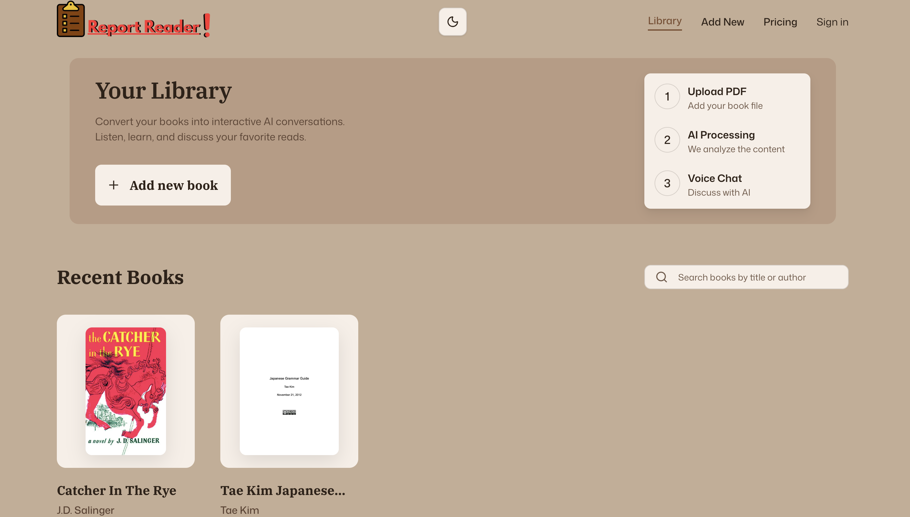

# Report Reader

**Report Reader** is an AI-powered document reading application built with Next.js, TypeScript, Clerk, MongoDB, Vercel Blob, and Vapi. The app lets users upload PDF documents, extract their text into searchable segments, choose an assistant voice, and discuss the uploaded material through an interactive voice or keyboard conversation.

## Project Overview

Report Reader is designed to make long documents easier to review by turning static PDFs into conversational reading sessions. Users can add a new document, provide its title and author, select an AI voice persona, and upload either a custom cover image or let the app generate one from the PDF's first page.

After upload, the PDF is parsed in the browser with `pdfjs-dist`, split into overlapping text segments, and stored in MongoDB for search. The original PDF and cover image are uploaded to Vercel Blob. Each document appears in the library where authenticated users can open a voice session and ask questions about the material. Vapi powers the live assistant experience, while a document-search API gives the assistant access to relevant stored text segments.

The app also includes Clerk authentication and subscription-aware limits for books, monthly sessions, and maximum session duration.

## Features

- **Authenticated document library:** Clerk protects upload and reading experiences while the homepage displays the user's searchable document collection.
- **PDF upload workflow:** Users upload a PDF, enter metadata, choose a voice persona, and optionally provide a cover image.
- **Automatic PDF parsing:** `pdfjs-dist` extracts text from every page and renders the first page as a fallback cover image.
- **Segmented document storage:** Extracted text is split into searchable MongoDB segments with word counts and segment indexes.
- **Blob file storage:** PDFs and cover images are uploaded through Vercel Blob with authenticated upload handling.
- **Duplicate document handling:** Documents are slugged from their titles, and matching uploads redirect to the existing document.
- **Voice and keyboard chat:** Vapi supports live voice sessions, transcript streaming, and typed follow-up messages during an active session.
- **Document search tool endpoint:** The Vapi tool route searches stored document segments and returns relevant passages to the assistant.
- **Subscription limits:** Free, standard, and pro plans control document count, monthly voice sessions, and max session length.
- **Responsive interface:** The library, upload form, subscription page, and voice session view use reusable components and theme-aware styling.

## Overall Application Structure

The application uses the Next.js App Router with server components for page data loading, client components for interactive upload and voice controls, server actions for database mutations, and API routes for Vercel Blob and Vapi integrations.

Book metadata is stored in the `Book` collection, extracted text lives in `BookSegment`, and voice usage is tracked in `VoiceSession`. The upload flow begins in the browser, where the PDF is parsed and sent to Vercel Blob. Server actions then create the book record and save text segments. During a reading session, Vapi manages the real-time conversation while the `/api/vapi/search-document` route searches MongoDB for passages related to the user's question.

### `app/(root)/page.tsx`

The root page renders the main library experience. It loads books through `getAllBooks`, applies an optional search query, displays the hero section, and maps each result into a `BookCard`.

### `components/HeroSection.tsx`

`HeroSection` introduces the document workflow with a library headline, an add-book call to action, and the three-step process of uploading a PDF, processing it, and starting an AI voice chat.

### `app/(root)/books/new/page.tsx` and `components/UploadForm.tsx`

The new-book page contains the PDF upload workflow. `UploadForm` validates fields with React Hook Form and Zod, parses the selected PDF, uploads the PDF and cover image to Vercel Blob, creates the book record, saves document segments, and redirects users back to the library.

### `app/api/upload/route.ts`

The upload route handles authenticated Vercel Blob client uploads. It checks Clerk authentication before generating upload tokens, limits uploads to PDF and supported image types, and enforces the configured maximum file size.

### `lib/utils.ts`

`utils.ts` contains shared helpers for class merging, slug generation, regex escaping, duration formatting, voice lookup, PDF parsing, and splitting extracted text into searchable document segments.

### `lib/actions/book.actions.ts`

Book actions manage the MongoDB document lifecycle. They fetch and search books, check duplicate titles by slug, create books after subscription validation, save extracted text segments, fetch a book by slug, and search document segments for Vapi tool calls.

### `app/books/[slug]/page.tsx`

The book detail route requires authentication, loads the requested book by slug, and renders the interactive reading session. Missing or unauthorized access redirects away from the session page.

### `components/VapiControls.tsx`

`VapiControls` renders the reading session interface. It shows the selected document, status indicators, session timer, voice controls, transcript display, and a keyboard input panel for typed messages during an active call.

### `hooks/useVapi.ts`

`useVapi` manages the Vapi SDK lifecycle. It starts and stops calls, listens for call and transcript events, streams current user and assistant messages, tracks session duration, sends typed messages, and enforces subscription session limits.

### `app/api/vapi/search-document/route.ts`

This route gives the Vapi assistant access to uploaded document content. It supports multiple Vapi tool-call payload formats, validates `bookId` and `query`, searches stored segments, and returns combined matching text.

### `lib/actions/session.actions.ts`

Session actions create and close voice session records. They check the user's plan limits before starting a session and update the final duration when the session ends.

### `app/(root)/subscriptions/page.tsx`

The subscription page renders Clerk's pricing table. It gives users a place to upgrade when they reach book or session limits.

## Tech Stack

- **Framework:** Next.js 16, React 19, TypeScript
- **Authentication and billing UI:** Clerk
- **Database:** MongoDB with Mongoose
- **File storage:** Vercel Blob
- **Voice AI:** Vapi with ElevenLabs voices
- **PDF processing:** `pdfjs-dist`
- **Forms and validation:** React Hook Form and Zod
- **Styling:** Tailwind CSS, CSS variables, `next-themes`, and shadcn-style UI components

## Challenges Faced / What I Learned

One challenge was connecting voice AI to private document content. The assistant cannot simply know what is inside a user's uploaded PDF, so the project stores extracted text in searchable segments and exposes a Vapi tool route that can retrieve relevant passages during a conversation.

This project also strengthened the architecture around subscription product behavior. Book creation and voice sessions both check plan limits on the server, while the client surfaces those limits through redirects, timers, and clear error messages.

## Deployment

